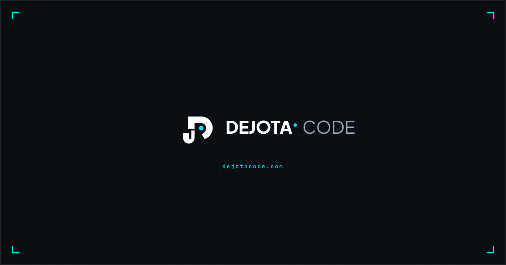

<p align="center">
  
</p>

<h1 align="center">Joceilton F. Santos · DejotaCode</h1>

<p align="center">
  Desenvolvedor e criador do <strong>DejotaCode</strong> — tecnologia prática para quem está começando.
</p>

<p align="center">
  <a href="https://dejotacode.com.br">Site</a> ·
  <a href="https://dejotacode.com.br/portfolio/">Portfólio</a> ·
  <a href="https://github.com/Dejotacode/dejotacode-api">API</a>
</p>

<p align="center">
  <a href="https://github.com/Dejotacode/dejotacode/actions/workflows/ci.yml"></a>
  <a href="https://github.com/Dejotacode/dejotacode/releases"></a>
  <a href="https://github.com/Dejotacode/dejotacode-api/releases"></a>
</p>

<p align="center">
  
  
  
  
  
</p>

<p align="center">
  
</p>

## Sobre mim

Sou o criador do **DejotaCode**, projeto que uso como laboratório real para desenvolvimento web, arquitetura edge, UX/UI, SEO, automação, segurança operacional e produto digital.

Meu foco atual é construir experiências simples para iniciantes sem abrir mão de engenharia verificável: mudanças isoladas em branches, Pull Requests, CI, releases versionadas, documentação operacional e validações explícitas antes de ações críticas.

## Projeto em destaque

O **DejotaCode** é uma plataforma educacional em tecnologia para iniciantes. O projeto combina conteúdo, produto e engenharia: blog, trilhas de aprendizagem, portfólio, newsletter, Admin Editorial, mídia em R2, analytics first-party e um fluxo de publicação baseado em GitHub e CI/CD.

| Produto | Link | Stack principal |
| --- | --- | --- |
| Frontend DejotaCode | [dejotacode.com.br](https://dejotacode.com.br) | Astro · TypeScript · Cloudflare Pages |
| DejotaCode API | [api.dejotacode.com.br](https://api.dejotacode.com.br) | Hono · Workers · D1 · R2 |

As versões atuais são exibidas pelos badges no topo e registradas em [Releases](https://github.com/Dejotacode/dejotacode/releases) e [API Releases](https://github.com/Dejotacode/dejotacode-api/releases).

## Arquitetura em uma visão

```text
Visitante → Astro / Cloudflare Pages
                 ↓
             DejotaCode API
          Hono / Workers
           ↙          ↘
         D1            R2

Admin Editorial → GitHub → Pull Request → CI → Cloudflare Pages
```

O conteúdo público permanece em Git/Markdown como fonte canônica. A API concentra formulários, métricas agregadas, autenticação administrativa e operações editoriais.

## Evidências do projeto

- frontend e API separados em repositórios públicos;
- CI executa typecheck, build e QA antes de cada deploy;
- deploy de produção do frontend ocorre somente após o job de qualidade da `main`;
- releases e tags registram marcos homologados;
- documentação cobre arquitetura, operação, backup, rollback e fluxo editorial;
- operações críticas de mídia usam revisão humana, dry-run, snapshot append-only e revalidação no servidor.

## Stack

- Astro 7
- TypeScript
- Node.js 24 no CI
- Cloudflare Pages para o frontend
- API separada em Cloudflare Workers
- D1 para persistência da API
- R2 para mídia
- GitHub Actions para CI

## Requisitos

- Node.js `>=22.12.0`
- npm com suporte a `package-lock.json` v3

## Instalação

```bash
npm ci
```

## Desenvolvimento local

Crie um arquivo `.env.development.local` com a URL local da API:

```env
PUBLIC_API_URL=http://localhost:8787
```

Depois execute:

```bash
npm run dev
```

O Astro usa `http://localhost:4321` por padrão quando a porta está disponível.

## Comandos principais

| Comando | Função |
| --- | --- |
| `npm run dev` | inicia o servidor local do Astro |
| `npm run check` | executa a validação do Astro/TypeScript |
| `npm run build` | gera o build estático padrão |
| `npm run build:preview` | valida o ambiente de preview e gera o build correspondente |
| `npm run build:production` | valida o ambiente de produção e gera o build correspondente |
| `npm run preview` | serve o conteúdo gerado localmente |

## Ambientes

A variável pública usada pelo frontend é:

```env
PUBLIC_API_URL=
```

Arquivos versionados:

- `.env.example` — referência de configuração;
- `.env.preview` — endpoint oficial de preview;
- `.env.production` — endpoint oficial de produção.

Configuração local não deve ser versionada. Use `.env.development.local`.

Variáveis com prefixo `PUBLIC_` podem ser incorporadas ao frontend e não devem conter segredos.

Os builds de preview e produção passam por `scripts/validate-build-env.mjs`, que exige HTTPS, rejeita endpoints locais nesses modos e confere o endpoint esperado para cada ambiente.

## Qualidade e CI

O workflow `.github/workflows/ci.yml` roda em:

- todo `pull_request`;
- todo `push` para `main`.

O job de qualidade usa permissões somente de leitura e executa instalação reproduzível, Astro check, build de produção e QA do HTML gerado.

Em Pull Requests, o fluxo termina após a validação. Em `push` para `main`, um segundo job depende do sucesso do quality gate, gera novamente o build de produção, faz deploy no **Cloudflare Pages** e executa o smoke test de produção. A credencial da Cloudflare é fornecida somente ao job de deploy por GitHub Secret.

## Analytics

O frontend possui analytics first-party agregado para navegação, conversão e progresso de trilhas. O script envia apenas os campos necessários para `/api/analytics`, usando `window.location.pathname` e campanhas explícitas quando existe contexto editorial ou de CTA.

Eventos do frontend:

- `page_view`
- `cta_click`
- `form_start`
- `lead_submit`
- `guide_access`
- `trail_start`
- `trail_lesson_click`
- `trail_complete`

A API também registra `contact_submit` diretamente no fluxo de contato. Não há envio de nome, e-mail, conteúdo de formulário, fingerprinting ou identificador persistente de visitante no payload de analytics.

## Admin Editorial

O Admin em `/admin/editor/` permite editar conteúdo, visualizar Markdown, enviar imagens ao R2 e abrir Pull Requests editoriais. A publicação continua passando por revisão humana, CI e merge protegido na `main`; D1 não é fonte do conteúdo público.

## SEO e distribuição

O projeto gera site estático com URL canônica `https://dejotacode.com.br` e utiliza integração de sitemap. Também possui feed RSS em `/rss.xml`.

Algumas rotas utilitárias ou ainda não destinadas à indexação são filtradas do sitemap na configuração do Astro.

## Estrutura principal

```text
.github/workflows/   CI
public/              ativos estáticos
scripts/             validações auxiliares
src/components/      componentes de interface
src/layouts/         layouts globais
src/pages/           rotas públicas
src/scripts/         scripts executados no frontend
src/styles/          estilos e tokens visuais
```

## Documentação técnica

- [`docs/architecture.md`](docs/architecture.md) — arquitetura e limites entre frontend e API;
- [`docs/operations.md`](docs/operations.md) — ambientes, QA, CI e regras operacionais;
- [`docs/runbook-deploy-rollback.md`](docs/runbook-deploy-rollback.md) — deploy, homologação e rollback;
- [`docs/backup-recovery.md`](docs/backup-recovery.md) — backup, recuperação e próximos controles operacionais.
- [`docs/admin-scope-v1.9.0.md`](docs/admin-scope-v1.9.0.md) — decisão histórica do Admin e atualização pós-v1.10.0.
- [`docs/editorial-workflow.md`](docs/editorial-workflow.md) — fluxo atual Admin → GitHub → CI → Pages e mídia R2.
- [`docs/v1.11.0-operational-reconciliation.md`](docs/v1.11.0-operational-reconciliation.md) — reconciliação operacional após v1.10.0.
- [`docs/r2-inventory-v1.11.0.md`](docs/r2-inventory-v1.11.0.md) — inventário read-only e estratégia de proteção da mídia R2.
- [`docs/api-source-reconciliation-v1.9.0.md`](docs/api-source-reconciliation-v1.9.0.md) — reconciliação da fonte canônica da API e direção operacional.
- [`docs/PAUSE-POINT-V1.21.0.md`](docs/PAUSE-POINT-V1.21.0.md) — ponto seguro de retomada após v1.21.0 / API v1.11.0.

## Segurança operacional

Este repositório de frontend não deve armazenar segredos em variáveis `PUBLIC_*`.

Deploy, tag e release são tratados como etapas separadas do desenvolvimento e não fazem parte do workflow de CI.

## Licença

Nenhuma licença de distribuição foi definida neste repositório até o momento.
